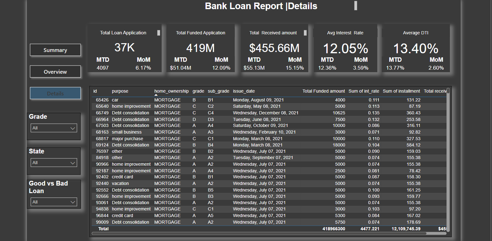

# bank_loan_data_analyst

Project Overview  
This project aims to create advanced interactive dashboards that offer deeper insights into loan data, overcoming the limitations of traditional reporting. These dashboards provide a holistic view of lending operations, borrower behavior, and loan performance metrics, enabling decision-makers to make informed, data-driven choices.  

Problem Statement  
Traditional methods for analyzing loan data lack depth and interactivity, limiting effective insights for informed decision-making. This project introduces advanced dashboard designs to unlock the full potential of loan data, enhancing our ability to view, analyze, and act on critical metrics.  

Objective  
This project focuses on developing a set of integrated dashboards that deliver dynamic and in-depth insights into loan data. By offering a comprehensive view of lending operations, borrower demographics, loan performance, and key financial metrics, these dashboards empower strategic, data-driven decision-making. 🚀  

Dashboard Structure 
Dashoard 1: Executive Summary
Provides a high-level overview of key performance indicators (KPIs) for efficient assessment of lending activities.  

Dashboard 2: Trends & Overview
Offers interactive visualizations to reveal trends in lending, borrower demographics, and loan purposes for identifying patterns and opportunities. 🔍  

Dashboard 3: Detailed Insights
Provides a comprehensive platform for in-depth analysis of loan portfolio metrics, supporting data-driven decision-making.

